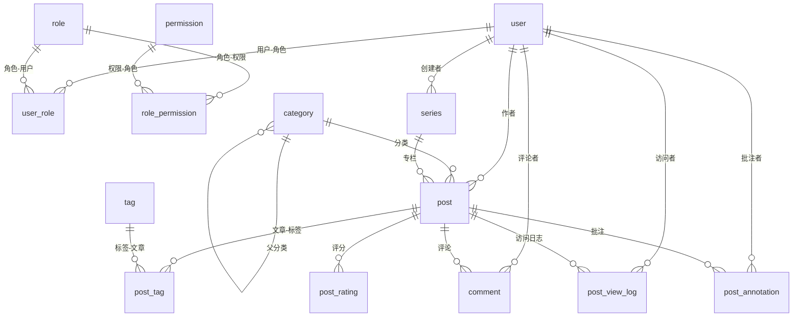

# 数据库表结构

bytedepth 使用 MySQL 8 + Flyway 管理迁移。表结构以 `bytedepth-start/src/main/resources/db/migration/` 下的迁移文件为唯一权威来源，本文档是迁移后的聚合视图，便于快速理解全貌。迁移文件变更时必须同步本文。

## ER 概览

## 内容表

### post — 博文

| 列 | 类型 | 约束 | 说明 |
| --- | --- | --- | --- |
| id | BIGINT | PK, AUTO_INCREMENT | |
| slug | VARCHAR(255) | NOT NULL, UNIQUE | URL 标识 |
| title | VARCHAR(255) | NOT NULL | 标题 |
| content | LONGTEXT | | Markdown 正文 |
| author_id | BIGINT | NOT NULL → user.id | 作者 |
| status | VARCHAR(20) | NOT NULL, DEFAULT 'DRAFT' | DRAFT / PUBLISHED / DELETED |
| featured | TINYINT(1) | NOT NULL, DEFAULT 0 | 首页推荐 |
| category_id | BIGINT | NULL → category.id | 所属分类 |
| series_id | BIGINT | NULL → series.id | 所属专栏 |
| series_order | INT | NULL | 专栏内排序（从 1 开始） |
| created_at | DATETIME | NOT NULL | |
| published_at | DATETIME | NULL | 发布时间 |
| updated_at | DATETIME | NOT NULL | |

### category — 分类

| 列 | 类型 | 约束 | 说明 |
| --- | --- | --- | --- |
| id | BIGINT | PK, AUTO_INCREMENT | |
| name | VARCHAR(100) | NOT NULL | 分类名称 |
| slug | VARCHAR(100) | NOT NULL, UNIQUE | URL 标识 |
| parent_id | BIGINT | NULL → category.id | 父分类（NULL 为顶级） |

### tag — 标签

| 列 | 类型 | 约束 | 说明 |
| --- | --- | --- | --- |
| id | BIGINT | PK, AUTO_INCREMENT | |
| name | VARCHAR(100) | NOT NULL, UNIQUE | 标签名 |
| slug | VARCHAR(100) | NOT NULL, UNIQUE | URL 标识 |

### post_tag — 文章-标签关联

| 列 | 类型 | 约束 | 说明 |
| --- | --- | --- | --- |
| post_id | BIGINT | PK, → post.id | |
| tag_id | BIGINT | PK, → tag.id | |

### series — 专栏

| 列 | 类型 | 约束 | 说明 |
| --- | --- | --- | --- |
| id | BIGINT | PK, AUTO_INCREMENT | |
| name | VARCHAR(100) | NOT NULL | 系列名称 |
| slug | VARCHAR(100) | NOT NULL, UNIQUE | URL 标识 |
| description | VARCHAR(500) | NULL | 系列简介 |
| author_id | BIGINT | NOT NULL → user.id, FK | 创建者 |

### comment — 评论

| 列 | 类型 | 约束 | 说明 |
| --- | --- | --- | --- |
| id | BIGINT | PK, AUTO_INCREMENT | |
| post_id | BIGINT | NOT NULL → post.id | 所属文章 |
| author_id | BIGINT | NULL → user.id | 评论者（登录用户） |
| author_name | VARCHAR(100) | NOT NULL | 评论者昵称 |
| content | TEXT | NOT NULL | 评论内容 |
| status | VARCHAR(20) | NOT NULL, DEFAULT 'PENDING' | PENDING / APPROVED / REJECTED |
| created_at | DATETIME | NOT NULL | |

### project — 项目展示

| 列 | 类型 | 约束 | 说明 |
| --- | --- | --- | --- |
| id | BIGINT | PK, AUTO_INCREMENT | |
| name | VARCHAR(100) | NOT NULL | 项目名称 |
| description | TEXT | | 项目描述 |
| tech_stack | VARCHAR(500) | | 技术栈（逗号分隔） |
| github_url | VARCHAR(500) | | GitHub 地址 |
| demo_url | VARCHAR(500) | | 演示地址 |
| sort_order | INT | NOT NULL, DEFAULT 0 | 排序（越小越靠前） |
| created_at | DATETIME | NOT NULL | |

## 账户与权限表

### user — 用户账号

| 列 | 类型 | 约束 | 说明 |
| --- | --- | --- | --- |
| id | BIGINT | PK, AUTO_INCREMENT | |
| username | VARCHAR(50) | NOT NULL, UNIQUE | 用户名 |
| password | VARCHAR(100) | NOT NULL | BCrypt 哈希 |
| email | VARCHAR(100) | NULL | |
| avatar | VARCHAR(255) | NULL | |
| bio | TEXT | NULL | 个人简介 |
| status | VARCHAR(20) | NOT NULL, DEFAULT 'PENDING' | PENDING / ACTIVE / BANNED |
| created_at | DATETIME | NOT NULL | |
| updated_at | DATETIME | NOT NULL | |

### role — 角色

| 列 | 类型 | 约束 | 说明 |
| --- | --- | --- | --- |
| id | BIGINT | PK, AUTO_INCREMENT | |
| name | VARCHAR(50) | NOT NULL, UNIQUE | ADMIN / USER |
| description | VARCHAR(255) | NULL | |
| created_at | DATETIME | NOT NULL | |

### permission — 权限

| 列 | 类型 | 约束 | 说明 |
| --- | --- | --- | --- |
| id | BIGINT | PK, AUTO_INCREMENT | |
| code | VARCHAR(100) | NOT NULL, UNIQUE | 如 blog:post:create |
| description | VARCHAR(255) | NULL | |
| module | VARCHAR(50) | NOT NULL | blog / project / system / admin |
| created_at | DATETIME | NOT NULL | |

### user_role — 用户-角色关联

| 列 | 类型 | 约束 | 说明 |
| --- | --- | --- | --- |
| user_id | BIGINT | PK, → user.id | |
| role_id | BIGINT | PK, → role.id | |

### role_permission — 角色-权限关联

| 列 | 类型 | 约束 | 说明 |
| --- | --- | --- | --- |
| role_id | BIGINT | PK, → role.id | |
| permission_id | BIGINT | PK, → permission.id | |

## 阅读交互表

### post_annotation — 文章批注

| 列 | 类型 | 约束 | 说明 |
| --- | --- | --- | --- |
| id | BIGINT | PK, AUTO_INCREMENT | |
| post_id | BIGINT | NOT NULL → post.id | 文章 ID |
| user_id | BIGINT | NULL → user.id | 登录批注作者（匿名时为空） |
| owner_token_hash | CHAR(64) | NULL | 匿名浏览器身份令牌的 SHA-256 摘要 |
| selected_text | VARCHAR(500) | NOT NULL | 被批注的文本 |
| annotation_text | TEXT | NULL | 批注评论（纯划线时为空） |
| color | VARCHAR(20) | NOT NULL, DEFAULT 'yellow' | red / yellow / green / blue |
| visibility | VARCHAR(16) | NOT NULL, DEFAULT 'PUBLIC' | PRIVATE / PUBLIC |
| start_offset | INT | NOT NULL | 正文 textContent 起始偏移 |
| end_offset | INT | NOT NULL | 正文 textContent 结束偏移 |
| created_at | DATETIME | NOT NULL | |
| deleted | TINYINT(1) | NOT NULL, DEFAULT 0 | 逻辑删除：文章内容变更后偏移无法重算时标记 |

### post_rating — 文章评分

| 列 | 类型 | 约束 | 说明 |
| --- | --- | --- | --- |
| id | BIGINT | PK, AUTO_INCREMENT | |
| post_id | BIGINT | NOT NULL → post.id | |
| visitor_token | VARCHAR(64) | NOT NULL | 匿名访客令牌 |
| score | TINYINT | NOT NULL, CHECK 1-5 | 评分 |
| created_at | DATETIME | NOT NULL | |
| updated_at | DATETIME | NOT NULL | |

唯一约束：`uk_post_rating_visitor (post_id, visitor_token)` — 同一访客对同一文章只能评一次。

## 访问日志表

### post_view_log — 文章访问日志

| 列 | 类型 | 约束 | 说明 |
| --- | --- | --- | --- |
| id | BIGINT | PK, AUTO_INCREMENT | |
| post_id | BIGINT | NOT NULL → post.id | |
| user_id | BIGINT | NULL → user.id | 登录用户（匿名为空） |
| ip | VARCHAR(64) | | 访客 IP |
| user_agent | VARCHAR(512) | | |
| referer | VARCHAR(512) | | |
| country | VARCHAR(64) | | GeoIP 解析 |
| city | VARCHAR(64) | | GeoIP 解析 |
| visited_at | DATETIME | NOT NULL | |
| visit_token | VARCHAR(64) | UNIQUE | 单次访问随机标识 |
| active_read_seconds | INT | NOT NULL, DEFAULT 0 | 累计有效阅读秒数 |
| max_scroll_depth | TINYINT UNSIGNED | NOT NULL, DEFAULT 0 | 最大阅读深度 0-100 |
| last_activity_at | DATETIME | NULL | 最后有效阅读活动时间 |
| completed_at | DATETIME | NULL | 首次完成阅读时间 |

### page_view_log — 页面访问日志

| 列 | 类型 | 约束 | 说明 |
| --- | --- | --- | --- |
| id | BIGINT | PK, AUTO_INCREMENT | |
| page_path | VARCHAR(255) | NOT NULL | 页面路径（如 /about） |
| user_id | BIGINT | NULL → user.id | 登录用户（匿名为空） |
| ip | VARCHAR(64) | | |
| user_agent | VARCHAR(512) | | |
| referer | VARCHAR(512) | | |
| country | VARCHAR(64) | | |
| city | VARCHAR(64) | | |
| visited_at | DATETIME | NOT NULL | |

## 访问统计聚合表

原始访问日志只作为近 7 天访问明细和归档输入源；以下表只保存 PV 聚合，不保存 IP、User-Agent、Referer、城市、访问令牌或阅读进度等明细字段。V25 由 Spring 定时任务按小时归档写入。

### post_view_hourly_stat — 文章小时 PV

| 列 | 类型 | 约束 | 说明 |
| --- | --- | --- | --- |
| stat_hour | DATETIME | PK, NOT NULL | 小时起点（Asia/Shanghai） |
| post_id | BIGINT | PK, NOT NULL | 文章 ID |
| view_count | BIGINT | NOT NULL, DEFAULT 0 | 该小时文章 PV |

主键：`(stat_hour, post_id)`；查询索引：`(post_id, stat_hour)`。

### page_view_hourly_stat — 页面小时 PV

| 列 | 类型 | 约束 | 说明 |
| --- | --- | --- | --- |
| stat_hour | DATETIME | PK, NOT NULL | 小时起点（Asia/Shanghai） |
| page_path | VARCHAR(255) | PK, NOT NULL | 页面路径 |
| view_count | BIGINT | NOT NULL, DEFAULT 0 | 该小时页面 PV |

主键：`(stat_hour, page_path)`；查询索引：`(page_path, stat_hour)`。

### post_view_country_daily_stat — 文章国家日 PV

| 列 | 类型 | 约束 | 说明 |
| --- | --- | --- | --- |
| stat_date | DATE | PK, NOT NULL | 自然日（Asia/Shanghai） |
| post_id | BIGINT | PK, NOT NULL | 文章 ID |
| country | VARCHAR(64) | PK, NOT NULL | 国家，空值为 未知 |
| view_count | BIGINT | NOT NULL, DEFAULT 0 | 该日该文章该国家 PV |

主键：`(stat_date, post_id, country)`；查询索引：`(post_id, stat_date)`、`(country, stat_date)`。

### page_view_country_daily_stat — 页面国家日 PV

字段与 `post_view_country_daily_stat` 相同，将 `post_id` 替换为 `page_path`。主键：`(stat_date, page_path, country)`；查询索引：`(page_path, stat_date)`、`(country, stat_date)`。

### view_log_archive_bucket — 访问日志小时归档状态

| 列 | 类型 | 约束 | 说明 |
| --- | --- | --- | --- |
| source | VARCHAR(16) | PK, NOT NULL | `post` 或 `page` |
| bucket_start | DATETIME | PK, NOT NULL | 已处理小时起点 |
| archived_at | DATETIME | NOT NULL | 最近一次归档完成时间 |
| archived_row_count | BIGINT | NOT NULL, DEFAULT 0 | 本次删除的明细数 |

主键：`(source, bucket_start)`，用于区分首次归档与迟到数据补偿。

### view_log_tablespace_state — 表空间维护状态

| 列 | 类型 | 约束 | 说明 |
| --- | --- | --- | --- |
| source | VARCHAR(16) | PK, NOT NULL | `post` 或 `page` |
| deleted_rows_since_optimize | BIGINT | NOT NULL, DEFAULT 0 | 上次成功表空间维护后的累计删除数 |
| last_optimized_at | DATETIME | NULL | 最近一次成功维护时间 |
| updated_at | DATETIME | NOT NULL | 状态更新时间 |

该表只保存维护计数，不保存访问明细；只有对应 `OPTIMIZE TABLE` 成功后才清零计数。

## 系统表

### page_stats — 页面访问统计

| 列 | 类型 | 约束 | 说明 |
| --- | --- | --- | --- |
| id | BIGINT | PK, AUTO_INCREMENT | |
| path | VARCHAR(200) | NOT NULL, UNIQUE | 页面路径 |
| pv_count | BIGINT | NOT NULL, DEFAULT 0 | 访问次数 |
| updated_at | DATETIME | NOT NULL | |

## 已废弃表

### admin_user — 旧管理员账号（V10 后废弃）

V10 引入统一 `user` 表后，`admin_user` 的数据已迁移到 `user`，该表仅保留用于历史追溯，不再使用。

## 关系说明

| 关系 | 基数 | 说明 |
| --- | --- | --- |
| user → post | 1:N | 一个作者多篇文章（post.author_id） |
| user → comment | 1:N | 登录用户的评论（comment.author_id，可为空） |
| user → series | 1:N | 专栏创建者（series.author_id，FK 约束） |
| user → post_annotation | 1:N | 登录用户的批注（user_id，可为空） |
| user → post_view_log | 1:N | 登录用户的访问记录（user_id，可为空） |
| category → post | 1:N | 文章所属分类（post.category_id） |
| category → category | 1:N | 分类树（parent_id 自引用） |
| series → post | 1:N | 文章所属专栏（post.series_id + series_order） |
| post ↔ tag | N:M | 通过 post_tag 关联表 |
| post → comment | 1:N | 文章下的评论 |
| post → post_annotation | 1:N | 文章下的批注 |
| post → post_rating | 1:N | 文章评分（唯一约束防止重复） |
| post → post_view_log | 1:N | 文章访问日志 |
| user ↔ role | N:M | 通过 user_role 关联 |
| role ↔ permission | N:M | 通过 role_permission 关联 |

## 迁移版本与表对照

| 版本 | 迁移文件 | 新增/变更 |
| --- | --- | --- |
| V1 | init_tables | post |
| V2 | add_tag_category_comment | category, tag, post_tag, comment, post.category_id |
| V3 | add_project_stats | project, page_stats |
| V4 | add_admin_user | admin_user（已废弃） |
| V6 | add_series | series, post.series_id, post.series_order |
| V10 | account_rbac | user, role, permission, user_role, role_permission, post.author_id, post.featured, comment.author_id |
| V11 | post_slug | post.slug |
| V12 | add_post_view_log | post_view_log |
| V13 | add_persistent_logins | persistent_logins（V23 删除） |
| V14 | add_post_rating | post_rating |
| V15 | add_post_reading_metrics | post_view_log 阅读指标列 |
| V18 | add_series_author | series.author_id（FK 约束） |
| V19 | add_page_view_log | page_view_log |
| V20 | add_post_annotation | post_annotation |
| V21 | upgrade_post_annotations_for_visibility | post_annotation 可见性与匿名归属 |
| V22 | add_annotation_deleted_flag | post_annotation.deleted |
| V23 | drop_persistent_logins | 删除 persistent_logins |
| V25 | add_view_log_archive_stats | 访问日志小时/国家聚合、归档状态、表空间维护状态 |

V5、V7、V8、V9、V16、V17 为种子数据迁移（分类、权限），不涉及表结构变更。
